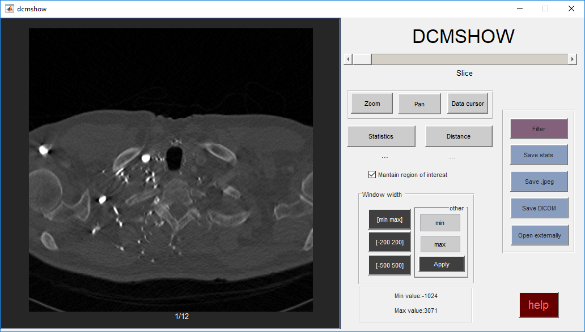
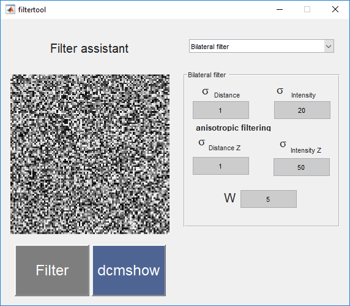

# SliceViewer
MATLAB interface for slice visualization given a volume.

<center>

</center>

## User interface 
This UI receives as an input argument a 3-dim matrix and launches the slice viewer called DCMSHOW.
The syntax to call UI is:

``` matlab
A = rand(100,100,100); %creates 100x100x100 random matrix
dcmshow(A);            %launches UI
```

The following functions are included:
* Basic image functionalities: navigate through slices, zoom and get pixel values.
* Measure distances in image.
* Noise quantifiction: mean and standard deviation computation inside patch.
* Change visualization window.
* Save statistics and images in .jpeg and dicom format.
* This tool was used for medical imaging applications, dicom reader function is also provided, small dicom free available sample for test is also provided provided. The syntax for dataset loading is:

``` matlab
volume = load_dcm('dcm_path'); %load all the filed in dcm_path folder
dmcshow(volume);
```

## Filtering
A small filtering user interface is provided and linked with DCMSHOW,to launch it just click the filter button within the UI.
You can also use it as a stand-alone application, as:
``` matlab
A = rand(100,100,100); 
filtered_volume = filtertool(A);
```
The following linear filters are available:
* Binomial filter: Gaussinan filter approximation for fast smoothing operations (low and high pass).
* Bilateral filtering: more robust filtering operation that considers distance and intensity differeces for current pixel output value computation.


<center>

</center>


## Installation and requirements
Clone repository and add to MATLAB path.

* This system has been tested in MATLAB versions 2014a and newer. (It's likely it will work in older versions).
* Image processing toolbox is required.
* For bilateral filtering, parallel computing toolbox is required.


## License
Feel free to use and change this software for any purpose.

Any kind of feedback is gladly appreciated

Jorge Mario Guerra 2019